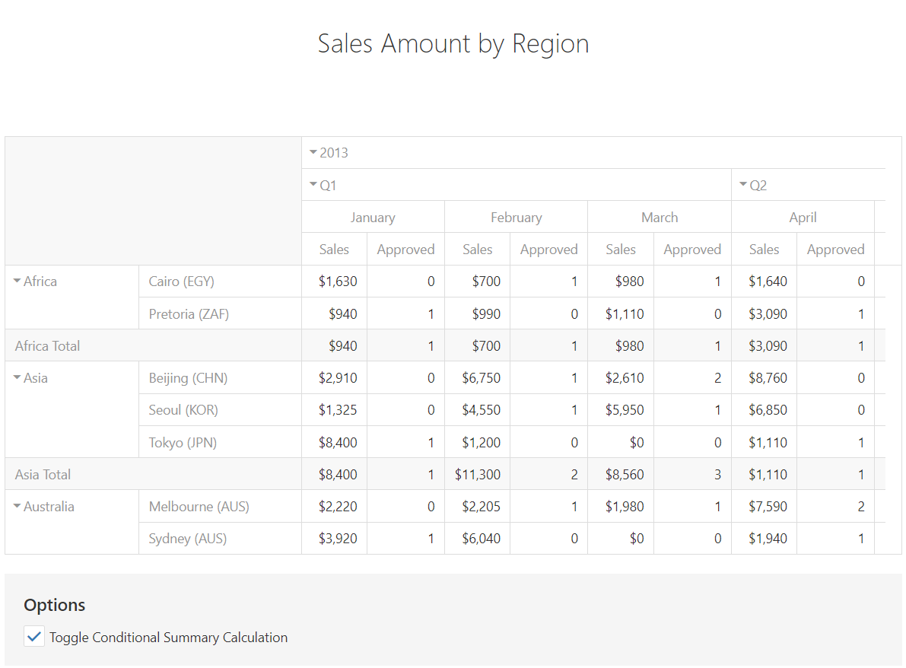

<!-- default badges list -->

<!-- default badges end -->

# PivotGrid for DevExtreme - How to conditionally calculate summary cell values

This example demonstrates how to configure a "data" field, which calculates values depending on another field. Here, the "Sales" field's values are calculated based on the "Approved" field. The calculateCustomSummary function is used for this scenario.

## Files to Review

- **Angular**
    - [app.component.html](Angular/src/app/app.component.html)
    - [app.component.ts](Angular/src/app/app.component.ts)
- **jQuery**
    - [index.html](jQuery/index.html)
- **React**
    - [App.js](React/src/App.js)
- **Vue**
    - [App.vue](Vue/src/App.vue)
- **ASP.NET**    
    - [Index.cshtml](ASPNET/SampleApp/Views/Home/Index.cshtml)

## Documentation

- [Getting Started with PivotGrid](https://js.devexpress.com/Documentation/Guide/UI_Components/PivotGrid/Getting_Started_with_PivotGrid/)

- [PivotGrid - API Reference](https://js.devexpress.com/Documentation/ApiReference/UI_Components/dxPivotGrid/)
<!-- feedback -->
## Does this example address your development requirements/objectives?

 

(you will be redirected to DevExpress.com to submit your response)
<!-- feedback end -->
